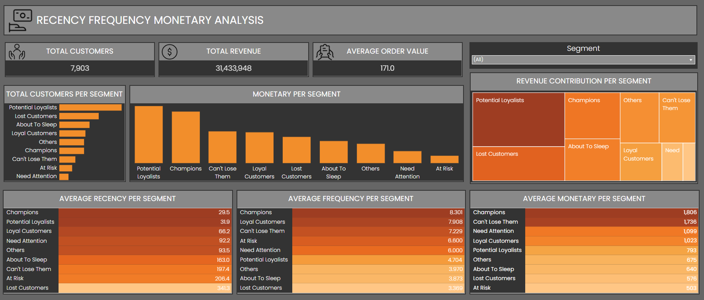

# Project Background

This project focuses on customer segmentation analysis for an e-commerce company using transaction data.

By applying the RFM (Recency, Frequency, Monetary) framework, customers are grouped based on their purchasing behavior to identify high-value segments, revenue contributors, and retention opportunities. The analysis aims to support marketing decision-making and loyalty strategy optimization through data-driven insights.

Insights and recommendations are provided on the following key areas:

- Segment customers based on RFM metrics.

- Identify high-value and revenue-driving customer groups.

- Provide actionable insights for marketing and retention strategies.

The jupyter notebook used to transfrom the data for this analysis can be found here [here](https://github.com/faqihelwidad/RFM-Analysis/blob/main/RFM_Analysis.ipynb).

An interactive Tableau dashboard used to report can be found here [here](https://public.tableau.com/app/profile/faqih.elwidad/viz/RECENCYFREQUENCYMONETARYANALYSIS/Dashboard1).

# Data Structure & Initial Checks

The dataset consists of a single transactional table containing order-level, customer, and product information used for analysis.

.

# Executive Summary
### Overview of Findings

This project applies RFM (Recency, Frequency, Monetary) analysis to segment customers based on transaction behavior and purchasing value. The analysis reveals that Champions customers demonstrate the strongest loyalty and spending behavior, while Potential Loyalists generate the highest total revenue due to their large population. These findings highlight key opportunities to strengthen customer retention and improve sales effectiveness through targeted strategies.

# Insights Deep Dive

### Customer Segmentation :

- The **Champions** segment records the highest average scores in recency, frequency, and monetary value, indicating that these customers purchase recently, frequently, and spend the most.

- This segment represents the most loyal and valuable customers in the business.

- High engagement consistency makes Champions a critical segment to retain.

- Any decline in this segment would have a significant impact on overall performance.

### Revenue Contribution by Segment :

- The **Potential Loyalists** segment contributes the highest total revenue among all segments.

- Despite having lower average frequency and monetary values, this segment contains the largest number of customers.

- The second-highest average recency indicates strong potential for repeat transactions.

- Converting this segment into loyal customers could significantly increase future revenue.

# Recommendations : 

- Provide loyalty rewards and exclusive benefits to customers in the **Champions** segment to maintain their high engagement and spending behavior.

- Prioritize retention strategies for Champions customers to prevent them from transitioning into lower-value segments.

- Introduce welcome offers or onboarding promotions for the **Potential Loyalists** segment.

- Encourage repeat purchases among Potential Loyalists through small, targeted discounts or personalized campaigns.

# Assumptions and Caveats

- Customer segmentation is based solely on historical transaction data and does not include external factors such as marketing campaigns or seasonality.

- RFM analysis assumes that recent and frequent purchasing behavior reflects customer loyalty.
